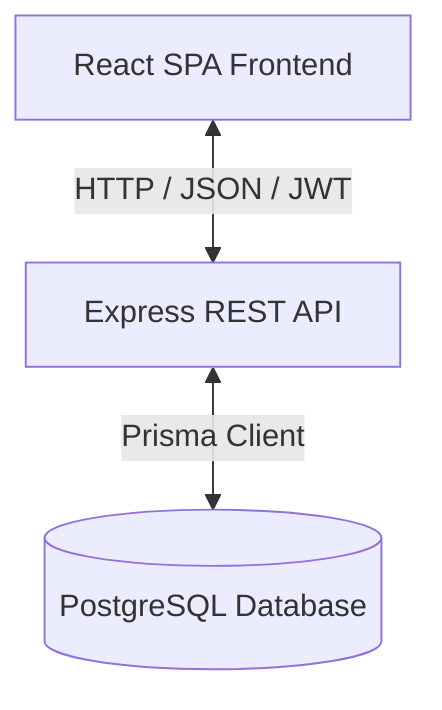
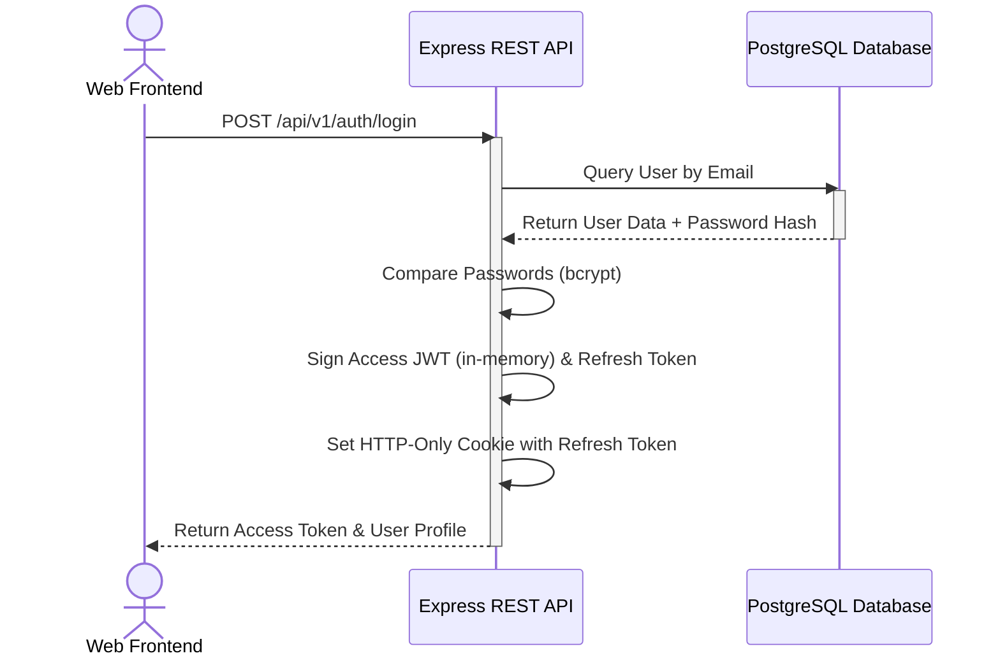
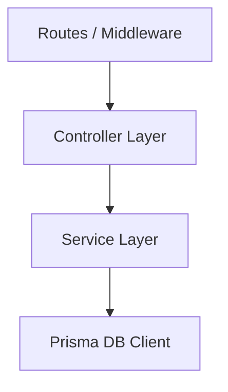
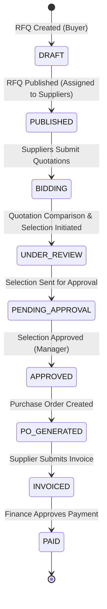

# VendorBridge Enterprise System Design & Architecture

This document details the backend architectural design patterns, database schema structures, frontend workflows, and security implementations that power the dynamic, database-driven VendorBridge procurement management platform.

---

## 1. System Overview

VendorBridge is built using a modern monorepo architecture:
- **Frontend**: Single Page Application (SPA) powered by React, Vite, CSS variables, and Zustand for state management.
- **Backend**: RESTful API built on Node.js and Express, adhering to an enterprise-grade modular architecture.
- **Database**: PostgreSQL handled via Prisma ORM for type-safe queries and automated schema migrations.



---

## 2. Authentication & Authorization Flow

VendorBridge enforces secure session management using short-lived Access JWTs and HTTP-Only refresh token cookies.

### 2.1 Login & Token Issuance Flow



### 2.2 JWT Verification Middleware
All protected routes verify the `Authorization: Bearer <Access_Token>` header. If expired, the frontend automatically issues a `/auth/refresh-token` handshake to acquire a new short-lived access token silently.

---

## 3. Role-Based Access Control (RBAC)

Strict permissions are configured on both the frontend dashboard routing/components and backend endpoint guards.

| Role | Description | Allowed Operations | REST Scope Constraints |
| :--- | :--- | :--- | :--- |
| **Admin** | System Administrator | Manage users, register vendors, inspect system-wide audit logs and analytics. | System-wide scope. |
| **Procurement Manager** | Procurement Lead | Approve/reject vendor selections, create and edit RFQs, generate POs and Invoices. | Approval workflows & PO authorization. |
| **Buyer** | Procurement Officer | Create RFQs, review quotations, submit vendor selections for approval. | Operational level RFQ & Bidding. |
| **Supplier** | Registered Vendor | View assigned RFQs, submit/revise bids, check POs, generate invoices. | Scoped strictly to their `vendorId`. |

---

## 4. Layered Pattern (Backend Modules)

Each module located under `src/modules/` follows a strict Controller-Service-Repository separation of concerns to maximize testability and maintainability:



- **Routes**: Matches API paths, defines HTTP methods, and injects validation schemas (Joi/Zod) and RBAC permission checks.
- **Controllers**: Responsible for parsing incoming requests (body, headers, query parameters), formatting standardized JSON responses, and delegating business rules.
- **Services**: Contains the core business logic (e.g., scoring quotations, calculating invoice taxation, transitioning state).
- **Database (Prisma)**: Manages database transactions, indexing, and raw model queries.

---

## 5. PostgreSQL Schema & Entity Relationships

The data model is structured around a relational procurement lifecycle:

```mermaid
erDiagram
    User ||--o{ Rfq : "creates"
    User ||--o{ PurchaseOrder : "purchases"
    Vendor ||--o{ User : "employs"
    Vendor ||--o{ Quotation : "submits"
    Vendor ||--o{ PurchaseOrder : "receives"
    Vendor ||--o{ Invoice : "bills"
    Rfq ||--o{ Quotation : "attracts"
    Rfq ||--o{ VendorSelection : "initiates"
    Quotation ||--o{ PurchaseOrder : "fufills"
    Quotation ||--o{ VendorSelection : "evaluates"
    PurchaseOrder ||--o{ Invoice : "invoices"

    User {
        uuid id PK
        string email UNIQUE
        string password
        string name
        string role "ADMIN / PROCUREMENT_MANAGER / BUYER / SUPPLIER"
        uuid vendorId FK
    }
    Vendor {
        uuid id PK
        string name
        string email
        string status "PENDING / APPROVED / REJECTED"
    }
    Rfq {
        uuid id PK
        string title
        string category
        string status "DRAFT / PUBLISHED / UNDER_REVIEW / COMPLETED"
        uuid createdById FK
        uuid_array assignedVendorIds
    }
    Quotation {
        uuid id PK
        uuid rfqId FK
        uuid vendorId FK
        decimal price
        decimal grandTotal
        string status "SUBMITTED / UNDER_REVIEW / ACCEPTED / REJECTED"
    }
    PurchaseOrder {
        uuid id PK
        string poNumber UNIQUE
        uuid quotationId FK
        uuid vendorId FK
        uuid buyerId FK
        decimal totalAmount
        string status "DRAFT / SENT / ACCEPTED / DELIVERED / CANCELLED"
    }
    Invoice {
        uuid id PK
        string invoiceNumber UNIQUE
        date dueDate
        string status "DRAFT / PAID / OVERDUE / PENDING_PAYMENT"
        uuid purchaseOrderId FK
        uuid vendorId FK
        decimal totalAmount
    }
    VendorSelection {
        uuid id PK
        uuid rfqId FK
        uuid vendorId FK
        uuid quotationId FK
        uuid selectedById FK
        string status "PENDING / APPROVED / REJECTED"
        int currentLevel "Approval level"
    }
```

---

## 6. End-to-End Procurement Lifecycle



1. **RFQ Dispatch**: A Procurement Officer drafts an RFQ, specifies items, and optionally restricts bidding to selected vendor IDs.
2. **Bidding**: Assigned suppliers receive notifications, view requirements, and submit formatted quotations (calculating subtotal, tax, and grand totals).
3. **Quotation Comparison**: The buyer compares submitted quotations using a structured matrix comparing price, timeline, tax, and terms.
4. **Approval Routing**: The buyer creates a `VendorSelection`. Depending on total value, it is routed through approval levels (e.g. manager authorization).
5. **PO Generation**: Once approved, a Purchase Order is automatically generated and dispatched to the winning vendor.
6. **Invoicing & Closeout**: The vendor delivers services/goods, issues an `Invoice` tied to the PO, which undergoes finance approval and shifts to `PAID` status.
