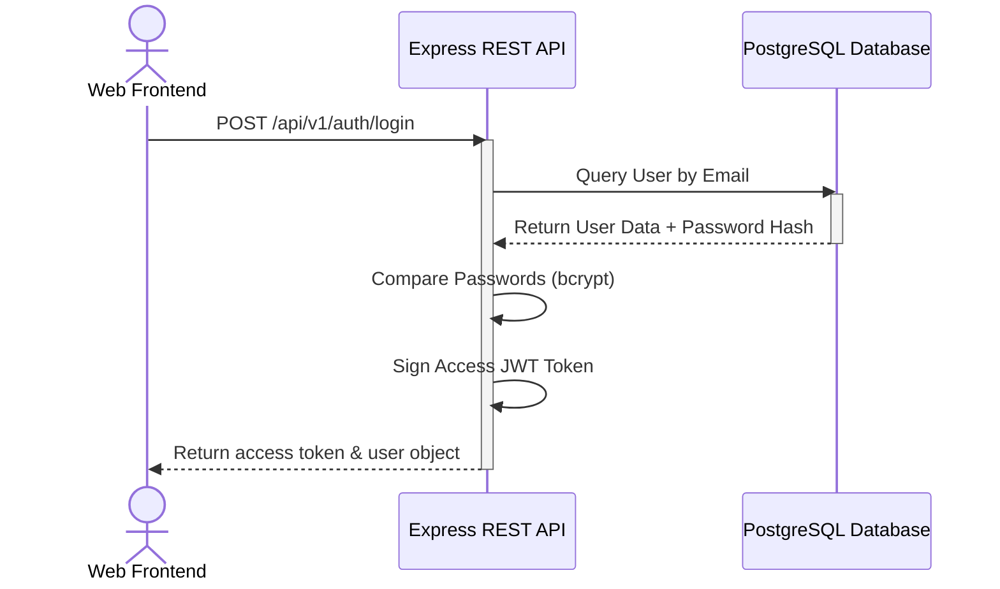

# VendorBridge Enterprise System Design

This document details the backend architectural design patterns and frontend workflows.

---

## 1. Authentication Data Flow

---

## 2. Layered Pattern (Backend Modules)

Each module located under `src/modules/` (e.g. `vendors`, `rfq`, `quotations`) follows a strict Repository-Service-Controller pattern to enforce the SOLID principles:

- **Route Layer**: Resolves endpoints, registers request validators, and maps to the appropriate controller method.
- **Controller Layer**: Decodes query/request body params, calls service layer actions, structures the standardized API response, and dispatches exceptions to the central handler.
- **Service Layer**: Implements business calculations, validation, status changes, and maps workflow rules.
- **Repository Layer**: The sole location where direct database access happens using the Prisma Client.
